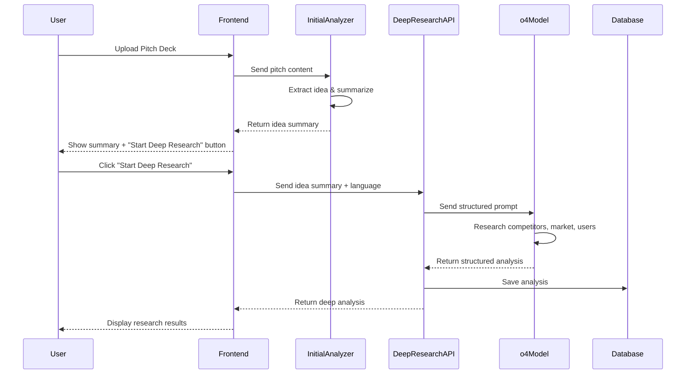
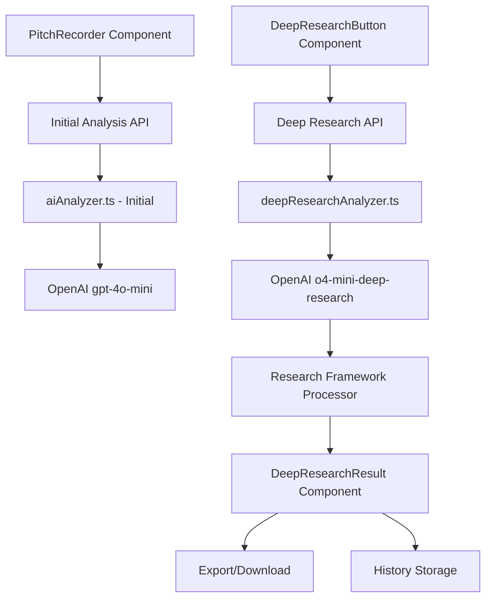

# Design Document: Deep Research Analysis

## Overview

این سیستم یک لایه تحلیل عمیق به Perfect Pitch اضافه می‌کند که از مدل o4-mini-deep-research OpenAI استفاده می‌کند. فرآیند به صورت دو مرحله‌ای است:

1. **مرحله اول**: مدل فعلی (gpt-4o-mini) pitch deck را تحلیل اولیه کرده و ایده اصلی را در 3-5 خط خلاصه می‌کند
2. **مرحله دوم**: خلاصه ایده به مدل o4-mini-deep-research ارسال می‌شود که تحقیق عمیق انجام داده و تحلیل جامع در یک framework ثابت ارائه می‌دهد

این رویکرد دو مزیت دارد:
- کاهش هزینه و زمان (مدل تحقیق عمیق فقط روی خلاصه کار می‌کند نه کل pitch deck)
- تمرکز بهتر مدل تحقیق روی ایده اصلی بدون حواس‌پرتی با جزئیات pitch

## Architecture

### High-Level Flow



### Component Architecture



## Components and Interfaces

### 1. Frontend Components

#### DeepResearchButton Component
```typescript
interface DeepResearchButtonProps {
  ideaSummary: string
  language: 'en' | 'fa'
  onResearchStart: () => void
  onResearchComplete: (result: DeepResearchResult) => void
  onError: (error: string) => void
}
```

مسئولیت‌ها:
- نمایش دکمه "شروع تحقیق عمیق"
- مدیریت loading state
- نمایش progress indicator
- مدیریت خطاها

#### DeepResearchResult Component
```typescript
interface DeepResearchResultProps {
  analysis: DeepResearchResult
  ideaSummary: string
  onExportPDF: () => void
  onCopyToClipboard: () => void
  onCompareWithInitial: () => void
}
```

مسئولیت‌ها:
- نمایش نتایج تحقیق در framework ثابت
- ارائه tab navigation برای بخش‌های مختلف
- امکان export و copy
- مقایسه با تحلیل اولیه

### 2. Backend Services

#### Initial Analyzer Enhancement
```typescript
// lib/aiAnalyzer.ts - Add new function
export async function extractIdeaSummary(
  input: {
    slides?: SlideContent[]
    transcript?: string
  }
): Promise<IdeaSummary> {
  // Extract and summarize core idea in 3-5 lines
}

interface IdeaSummary {
  summary: string // 3-5 line summary
  problemStatement: string
  solutionStatement: string
  targetMarket: string
  keyDifferentiator: string
}
```

#### Deep Research Analyzer (New)
```typescript
// lib/deepResearchAnalyzer.ts
export async function performDeepResearch(
  ideaSummary: IdeaSummary,
  language: 'en' | 'fa'
): Promise<DeepResearchResult> {
  // Call o4-mini-deep-research with structured prompt
}

interface DeepResearchResult {
  ideaSummary: IdeaSummary
  competitorAnalysis: CompetitorAnalysis
  targetAudienceAnalysis: TargetAudienceAnalysis
  valuePropositionAnalysis: ValuePropositionAnalysis
  marketAnalysis: MarketAnalysis
  competitiveAdvantage: CompetitiveAdvantage
  risksAndChallenges: RisksAndChallenges
  strategicRecommendations: StrategicRecommendations
  generatedAt: string
  language: 'en' | 'fa'
}
```

### 3. API Routes

#### POST /api/deep-research
```typescript
// app/api/deep-research/route.ts
export async function POST(request: Request) {
  // 1. Verify authentication
  // 2. Check usage limits
  // 3. Parse request body (ideaSummary, language)
  // 4. Call performDeepResearch()
  // 5. Save to database
  // 6. Return result
}

interface DeepResearchRequest {
  ideaSummary: IdeaSummary
  language: 'en' | 'fa'
}
```

## Data Models

### IdeaSummary
```typescript
interface IdeaSummary {
  summary: string // 3-5 خط خلاصه کلی
  problemStatement: string // مشکلی که حل می‌شود
  solutionStatement: string // راه‌حل پیشنهادی
  targetMarket: string // بازار هدف
  keyDifferentiator: string // تمایز کلیدی
}
```

### CompetitorAnalysis
```typescript
interface CompetitorAnalysis {
  directCompetitors: Competitor[]
  indirectCompetitors: Competitor[]
  competitiveMatrix: CompetitiveMatrix
  marketPositioning: string
}

interface Competitor {
  name: string
  description: string
  strengths: string[]
  weaknesses: string[]
  pricing?: string
  marketShare?: string
  differentiators: string[]
}

interface CompetitiveMatrix {
  features: string[] // لیست ویژگی‌ها
  comparison: Record<string, Record<string, boolean | string>> // competitor -> feature -> value
}
```

### TargetAudienceAnalysis
```typescript
interface TargetAudienceAnalysis {
  personas: UserPersona[]
  marketSize: MarketSize
  adoptionBarriers: string[]
  adoptionDrivers: string[]
}

interface UserPersona {
  name: string
  description: string
  demographics: string
  painPoints: string[]
  needs: string[]
  reasonsToUse: string[]
  willingnessToPay: string
}

interface MarketSize {
  tam: string // Total Addressable Market
  sam: string // Serviceable Addressable Market
  som: string // Serviceable Obtainable Market
  methodology: string
}
```

### ValuePropositionAnalysis
```typescript
interface ValuePropositionAnalysis {
  coreValue: string
  problemsSolved: ProblemSolved[]
  valueHierarchy: string[] // از مهم‌ترین به کم‌اهمیت‌ترین
  recommendedMessaging: string[]
}

interface ProblemSolved {
  problem: string
  solution: string
  priority: 'high' | 'medium' | 'low'
  userImpact: string
}
```

### MarketAnalysis
```typescript
interface MarketAnalysis {
  marketSize: MarketSize
  trends: MarketTrend[]
  opportunities: Opportunity[]
  threats: Threat[]
  growthProjection: string
}

interface MarketTrend {
  trend: string
  impact: 'positive' | 'negative' | 'neutral'
  timeframe: string
  relevance: string
}

interface Opportunity {
  opportunity: string
  potential: 'high' | 'medium' | 'low'
  timeToCapture: string
  requiredResources: string[]
}

interface Threat {
  threat: string
  severity: 'high' | 'medium' | 'low'
  likelihood: 'high' | 'medium' | 'low'
  mitigation: string
}
```

### CompetitiveAdvantage
```typescript
interface CompetitiveAdvantage {
  advantages: Advantage[]
  moat: string // خندق رقابتی
  sustainability: string
  defensibility: string
}

interface Advantage {
  advantage: string
  type: 'technology' | 'market' | 'team' | 'timing' | 'other'
  strength: 'strong' | 'moderate' | 'weak'
  explanation: string
}
```

### RisksAndChallenges
```typescript
interface RisksAndChallenges {
  risks: Risk[]
  challenges: Challenge[]
  mitigationStrategies: string[]
}

interface Risk {
  risk: string
  category: 'market' | 'technical' | 'financial' | 'regulatory' | 'competitive'
  probability: 'high' | 'medium' | 'low'
  impact: 'high' | 'medium' | 'low'
  mitigation: string
}

interface Challenge {
  challenge: string
  difficulty: 'high' | 'medium' | 'low'
  timeframe: string
  approach: string
}
```

### StrategicRecommendations
```typescript
interface StrategicRecommendations {
  quickWins: Recommendation[]
  longTermInitiatives: Recommendation[]
  priorityOrder: string[]
  keyMetrics: string[]
}

interface Recommendation {
  title: string
  description: string
  rationale: string
  expectedImpact: string
  effort: 'low' | 'medium' | 'high'
  timeframe: string
  priority: number
}
```

### DeepResearchResult
```typescript
interface DeepResearchResult {
  id: string
  userId: string
  ideaSummary: IdeaSummary
  competitorAnalysis: CompetitorAnalysis
  targetAudienceAnalysis: TargetAudienceAnalysis
  valuePropositionAnalysis: ValuePropositionAnalysis
  marketAnalysis: MarketAnalysis
  competitiveAdvantage: CompetitiveAdvantage
  risksAndChallenges: RisksAndChallenges
  strategicRecommendations: StrategicRecommendations
  generatedAt: string
  language: 'en' | 'fa'
}
```

## Correctness Properties

*یک property یک ویژگی یا رفتاری است که باید در تمام اجراهای معتبر سیستم برقرار باشد - در واقع یک بیانیه رسمی درباره آنچه سیستم باید انجام دهد. Properties پلی بین مشخصات قابل خواندن توسط انسان و تضمین‌های صحت قابل تایید توسط ماشین هستند.*

### Property 1: Idea Summary Structure Completeness
*For any* valid pitch deck content, when processed by the Initial_Analyzer, the resulting IdeaSummary must contain all required fields (summary, problemStatement, solutionStatement, targetMarket, keyDifferentiator) with non-empty values.
**Validates: Requirements 1.2**

### Property 2: Idea Summary Length Constraint
*For any* generated IdeaSummary, the summary field must contain between 3 and 5 lines (counting by newline characters).
**Validates: Requirements 1.3**

### Property 3: Deep Research Request Transmission
*For any* IdeaSummary and language selection, when the deep research is initiated, the system must transmit the complete IdeaSummary to the Deep_Research_Model without data loss.
**Validates: Requirements 2.1**

### Property 4: Error Handling Completeness
*For any* API error (rate limit, timeout, authentication failure), the system must return a user-friendly error message that does not expose internal implementation details.
**Validates: Requirements 2.4, 10.3**

### Property 5: Research Framework Schema Compliance
*For any* DeepResearchResult returned by the system, it must conform to the complete Research_Framework schema including all required sections: competitorAnalysis, targetAudienceAnalysis, valuePropositionAnalysis, marketAnalysis, competitiveAdvantage, risksAndChallenges, and strategicRecommendations.
**Validates: Requirements 3.1, 3.2-3.8**

### Property 6: Competitor Analysis Minimum Count
*For any* CompetitorAnalysis, the directCompetitors array must contain at least 3 competitors, and each competitor must have non-empty strengths and weaknesses arrays.
**Validates: Requirements 4.1, 4.2**

### Property 7: Competitor Differentiation Completeness
*For any* competitor in the CompetitorAnalysis, the differentiators field must be present and contain at least one differentiation point.
**Validates: Requirements 4.3**

### Property 8: Target Audience Persona Count
*For any* TargetAudienceAnalysis, the personas array must contain between 2 and 3 UserPersona objects, and each persona must have non-empty painPoints, needs, and reasonsToUse arrays.
**Validates: Requirements 5.1, 5.2, 5.3**

### Property 9: Market Size Completeness
*For any* MarketSize object, all three fields (tam, sam, som) must be present with non-empty values, and methodology must explain the calculation approach.
**Validates: Requirements 5.4, 7.1**

### Property 10: Value Proposition Structure
*For any* ValuePropositionAnalysis, the coreValue must be non-empty, problemsSolved must be a non-empty array, and each ProblemSolved must have a priority field with value 'high', 'medium', or 'low'.
**Validates: Requirements 6.1, 6.2, 6.3**

### Property 11: Market Analysis Completeness
*For any* MarketAnalysis, the trends, opportunities, and threats arrays must all be non-empty, demonstrating comprehensive market research.
**Validates: Requirements 7.2, 7.3, 7.4**

### Property 12: Strategic Recommendations Minimum Count
*For any* StrategicRecommendations, the combined count of quickWins and longTermInitiatives must be at least 5, and each recommendation must have a non-empty rationale and priority value.
**Validates: Requirements 8.1, 8.2, 8.3**

### Property 13: Recommendations Categorization
*For any* StrategicRecommendations, quickWins and longTermInitiatives must be distinct arrays with no overlap, ensuring clear separation of immediate actions from long-term strategies.
**Validates: Requirements 8.4**

### Property 14: Database Persistence
*For any* successfully completed DeepResearchResult, a corresponding record must be created in the database with the userId, timestamp, and complete analysis data.
**Validates: Requirements 9.4**

### Property 15: API Timeout Handling
*For any* API request to the Deep_Research_Model, if the request exceeds the configured timeout threshold, the system must abort the request and return a timeout error to the user.
**Validates: Requirements 10.5**

### Property 16: Prompt Language Consistency
*For any* deep research request with language set to 'fa', the system prompt must include instructions for Persian language output, and for language 'en', it must include instructions for English output.
**Validates: Requirements 12.1, 12.2, 12.4**

### Property 17: JSON Response Parsability
*For any* response from the Deep_Research_Model, the system must be able to parse it as valid JSON conforming to the DeepResearchResult schema without throwing parsing errors.
**Validates: Requirements 11.5**


## Error Handling

### 1. API Errors

#### OpenAI API Errors
```typescript
class DeepResearchError extends Error {
  constructor(
    message: string,
    public code: string,
    public statusCode: number,
    public retryable: boolean
  ) {
    super(message)
  }
}

// Error mapping
const handleOpenAIError = (error: any): DeepResearchError => {
  if (error.status === 429) {
    return new DeepResearchError(
      'Rate limit exceeded. Please try again in a few minutes.',
      'RATE_LIMIT',
      429,
      true
    )
  }
  if (error.status === 401) {
    return new DeepResearchError(
      'Authentication failed. Please check API configuration.',
      'AUTH_ERROR',
      401,
      false
    )
  }
  if (error.name === 'AbortError') {
    return new DeepResearchError(
      'Request timed out. Please try again.',
      'TIMEOUT',
      504,
      true
    )
  }
  return new DeepResearchError(
    'Deep research failed. Please try again.',
    'UNKNOWN_ERROR',
    500,
    true
  )
}
```

### 2. Validation Errors

#### Input Validation
```typescript
const validateIdeaSummary = (summary: IdeaSummary): ValidationResult => {
  const errors: string[] = []
  
  if (!summary.summary || summary.summary.trim().length === 0) {
    errors.push('Summary is required')
  }
  
  const lineCount = summary.summary.split('\n').length
  if (lineCount < 3 || lineCount > 5) {
    errors.push('Summary must be between 3-5 lines')
  }
  
  if (!summary.problemStatement) {
    errors.push('Problem statement is required')
  }
  
  if (!summary.solutionStatement) {
    errors.push('Solution statement is required')
  }
  
  return {
    valid: errors.length === 0,
    errors
  }
}
```

#### Output Validation
```typescript
const validateDeepResearchResult = (result: any): ValidationResult => {
  const schema = {
    competitorAnalysis: 'object',
    targetAudienceAnalysis: 'object',
    valuePropositionAnalysis: 'object',
    marketAnalysis: 'object',
    competitiveAdvantage: 'object',
    risksAndChallenges: 'object',
    strategicRecommendations: 'object'
  }
  
  const errors: string[] = []
  
  for (const [key, type] of Object.entries(schema)) {
    if (!result[key] || typeof result[key] !== type) {
      errors.push(`Missing or invalid ${key}`)
    }
  }
  
  // Validate competitor count
  if (result.competitorAnalysis?.directCompetitors?.length < 3) {
    errors.push('At least 3 direct competitors required')
  }
  
  // Validate persona count
  const personaCount = result.targetAudienceAnalysis?.personas?.length || 0
  if (personaCount < 2 || personaCount > 3) {
    errors.push('Must have 2-3 user personas')
  }
  
  return {
    valid: errors.length === 0,
    errors
  }
}
```

### 3. Timeout Handling

```typescript
const TIMEOUTS = {
  INITIAL_ANALYSIS: 15000, // 15 seconds
  DEEP_RESEARCH: 60000, // 60 seconds (o4 models are slower)
  DATABASE_OPERATION: 5000 // 5 seconds
}

const withTimeout = async <T>(
  promise: Promise<T>,
  timeoutMs: number,
  errorMessage: string
): Promise<T> => {
  const controller = new AbortController()
  const timeoutId = setTimeout(() => controller.abort(), timeoutMs)
  
  try {
    const result = await promise
    clearTimeout(timeoutId)
    return result
  } catch (error: any) {
    clearTimeout(timeoutId)
    if (error.name === 'AbortError') {
      throw new DeepResearchError(errorMessage, 'TIMEOUT', 504, true)
    }
    throw error
  }
}
```

### 4. User-Facing Error Messages

```typescript
const ERROR_MESSAGES = {
  en: {
    RATE_LIMIT: 'Too many requests. Please wait a few minutes and try again.',
    TIMEOUT: 'Analysis is taking longer than expected. Please try again.',
    AUTH_ERROR: 'Authentication failed. Please contact support.',
    INVALID_INPUT: 'Invalid pitch deck content. Please check your input.',
    NETWORK_ERROR: 'Network error. Please check your connection.',
    UNKNOWN_ERROR: 'Something went wrong. Please try again.'
  },
  fa: {
    RATE_LIMIT: 'درخواست‌های زیادی ارسال شده. لطفا چند دقیقه صبر کنید.',
    TIMEOUT: 'تحلیل بیش از حد معمول طول کشید. لطفا دوباره تلاش کنید.',
    AUTH_ERROR: 'خطای احراز هویت. لطفا با پشتیبانی تماس بگیرید.',
    INVALID_INPUT: 'محتوای pitch deck نامعتبر است. لطفا ورودی خود را بررسی کنید.',
    NETWORK_ERROR: 'خطای شبکه. لطفا اتصال اینترنت خود را بررسی کنید.',
    UNKNOWN_ERROR: 'خطایی رخ داد. لطفا دوباره تلاش کنید.'
  }
}
```

## Testing Strategy

### Overview

این پروژه از دو رویکرد تست استفاده می‌کند:
- **Unit Tests**: برای تست موارد خاص، edge cases و شرایط خطا
- **Property-Based Tests**: برای تست properties جهانی در تمام ورودی‌ها

### Testing Framework

- **Unit Testing**: Jest + React Testing Library
- **Property-Based Testing**: fast-check (برای TypeScript/JavaScript)
- **API Testing**: Supertest
- **E2E Testing**: Playwright (optional)

### Property-Based Testing Configuration

هر property test باید:
- حداقل 100 iteration اجرا شود
- با comment مشخص شود که کدام property از design را تست می‌کند
- از generators هوشمند برای تولید داده‌های معتبر استفاده کند

```typescript
// Example property test
import fc from 'fast-check'

describe('Deep Research Analysis - Property Tests', () => {
  test('Property 1: Idea Summary Structure Completeness', () => {
    // Feature: deep-research-analysis, Property 1
    fc.assert(
      fc.property(
        pitchDeckGenerator(), // Smart generator for pitch decks
        async (pitchDeck) => {
          const summary = await extractIdeaSummary(pitchDeck)
          
          expect(summary.summary).toBeTruthy()
          expect(summary.problemStatement).toBeTruthy()
          expect(summary.solutionStatement).toBeTruthy()
          expect(summary.targetMarket).toBeTruthy()
          expect(summary.keyDifferentiator).toBeTruthy()
        }
      ),
      { numRuns: 100 }
    )
  })
})
```

### Unit Testing Strategy

#### 1. Component Tests
```typescript
describe('DeepResearchButton', () => {
  it('should be disabled when no idea summary is provided', () => {
    // Test specific example
  })
  
  it('should show loading state when research is in progress', () => {
    // Test UI state
  })
  
  it('should display error message on API failure', () => {
    // Test error handling
  })
})
```

#### 2. API Route Tests
```typescript
describe('POST /api/deep-research', () => {
  it('should return 401 when not authenticated', async () => {
    // Test authentication
  })
  
  it('should return 403 when usage limit exceeded', async () => {
    // Test rate limiting
  })
  
  it('should return 400 when idea summary is invalid', async () => {
    // Test validation
  })
})
```

#### 3. Service Layer Tests
```typescript
describe('deepResearchAnalyzer', () => {
  it('should handle rate limit errors gracefully', async () => {
    // Mock API error
    // Verify error handling
  })
  
  it('should timeout after 60 seconds', async () => {
    // Test timeout behavior
  })
})
```

### Test Data Generators

```typescript
// Smart generators for property-based testing
const pitchDeckGenerator = () => fc.record({
  transcript: fc.string({ minLength: 100, maxLength: 5000 }),
  slides: fc.array(
    fc.record({
      pageNumber: fc.nat(),
      text: fc.string({ minLength: 50, maxLength: 500 })
    }),
    { minLength: 5, maxLength: 20 }
  )
})

const ideaSummaryGenerator = () => fc.record({
  summary: fc.array(fc.string(), { minLength: 3, maxLength: 5 })
    .map(lines => lines.join('\n')),
  problemStatement: fc.string({ minLength: 20, maxLength: 200 }),
  solutionStatement: fc.string({ minLength: 20, maxLength: 200 }),
  targetMarket: fc.string({ minLength: 10, maxLength: 100 }),
  keyDifferentiator: fc.string({ minLength: 10, maxLength: 100 })
})
```

### Integration Testing

```typescript
describe('End-to-End Deep Research Flow', () => {
  it('should complete full research cycle', async () => {
    // 1. Upload pitch deck
    // 2. Extract idea summary
    // 3. Initiate deep research
    // 4. Verify complete result
    // 5. Verify database persistence
  })
})
```

### Performance Testing

```typescript
describe('Performance Tests', () => {
  it('should complete initial analysis within 15 seconds', async () => {
    const start = Date.now()
    await extractIdeaSummary(largePitchDeck)
    const duration = Date.now() - start
    expect(duration).toBeLessThan(15000)
  })
  
  it('should complete deep research within 60 seconds', async () => {
    const start = Date.now()
    await performDeepResearch(ideaSummary, 'en')
    const duration = Date.now() - start
    expect(duration).toBeLessThan(60000)
  })
})
```

### Test Coverage Goals

- **Unit Tests**: 80% code coverage
- **Property Tests**: All 17 correctness properties covered
- **Integration Tests**: All critical user flows covered
- **E2E Tests**: Happy path + major error scenarios

### Continuous Integration

```yaml
# .github/workflows/test.yml
name: Test Deep Research Feature

on: [push, pull_request]

jobs:
  test:
    runs-on: ubuntu-latest
    steps:
      - uses: actions/checkout@v2
      - uses: actions/setup-node@v2
      - run: npm install
      - run: npm run test:unit
      - run: npm run test:property
      - run: npm run test:integration
```

## Implementation Notes

### Prompt Engineering for o4-mini-deep-research

مدل o4-mini-deep-research یک مدل reasoning است که برای تحقیق عمیق طراحی شده. برای بهترین نتایج:

1. **System Prompt باید ساختاریافته باشد**:
```typescript
const DEEP_RESEARCH_SYSTEM_PROMPT = `You are a business research analyst conducting deep market research.

Your task is to analyze a business idea and provide comprehensive research in the following framework:

1. COMPETITOR ANALYSIS
   - Identify 3-5 direct competitors
   - Analyze strengths, weaknesses, pricing
   - Determine key differentiators

2. TARGET AUDIENCE ANALYSIS
   - Define 2-3 user personas
   - Identify pain points and needs
   - Explain reasons to use the product

3. VALUE PROPOSITION ANALYSIS
   - Identify core value
   - List problems solved with priorities
   - Recommend messaging strategy

4. MARKET ANALYSIS
   - Estimate TAM, SAM, SOM
   - Identify current trends
   - List opportunities and threats

5. COMPETITIVE ADVANTAGE
   - Identify key advantages
   - Assess sustainability and defensibility

6. RISKS AND CHALLENGES
   - List major risks with probability/impact
   - Identify key challenges

7. STRATEGIC RECOMMENDATIONS
   - Provide 5+ actionable recommendations
   - Separate quick wins from long-term initiatives
   - Prioritize by impact and effort

Output must be valid JSON matching the DeepResearchResult schema.
Language: {LANGUAGE}
`
```

2. **User Prompt باید شامل context کافی باشد**:
```typescript
const userPrompt = `
BUSINESS IDEA SUMMARY:
${ideaSummary.summary}

PROBLEM STATEMENT:
${ideaSummary.problemStatement}

SOLUTION STATEMENT:
${ideaSummary.solutionStatement}

TARGET MARKET:
${ideaSummary.targetMarket}

KEY DIFFERENTIATOR:
${ideaSummary.keyDifferentiator}

Please conduct comprehensive research and provide analysis in the specified framework.
`
```

### Database Schema

```typescript
// Firestore collection: deepResearchAnalyses
interface DeepResearchDocument {
  id: string
  userId: string
  pitchDeckId?: string // Link to original pitch deck
  ideaSummary: IdeaSummary
  result: DeepResearchResult
  createdAt: Timestamp
  language: 'en' | 'fa'
  status: 'pending' | 'completed' | 'failed'
  error?: string
}
```

### Cost Optimization

مدل o4-mini-deep-research گران‌تر از gpt-4o-mini است، پس:

1. **فقط خلاصه را ارسال کنیم** (نه کل pitch deck)
2. **Cache کردن نتایج** برای ایده‌های مشابه
3. **Rate limiting** برای جلوگیری از abuse
4. **Usage tracking** برای مدیریت هزینه

```typescript
// Check if similar analysis exists
const findSimilarAnalysis = async (
  ideaSummary: IdeaSummary
): Promise<DeepResearchResult | null> => {
  // Use vector similarity or text matching
  // Return cached result if similarity > 90%
}
```

### Bilingual Support Implementation

```typescript
const getLocalizedFramework = (language: 'en' | 'fa') => {
  const frameworks = {
    en: {
      competitorAnalysis: 'Competitor Analysis',
      targetAudience: 'Target Audience',
      valueProposition: 'Value Proposition',
      // ...
    },
    fa: {
      competitorAnalysis: 'تحلیل رقبا',
      targetAudience: 'کاربران هدف',
      valueProposition: 'ارزش پیشنهادی',
      // ...
    }
  }
  return frameworks[language]
}
```
