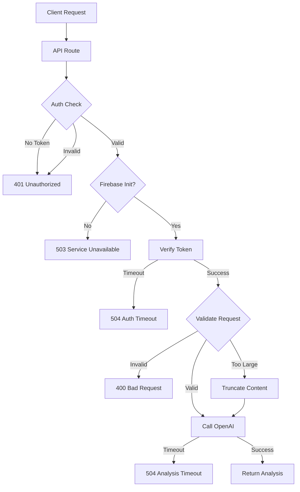
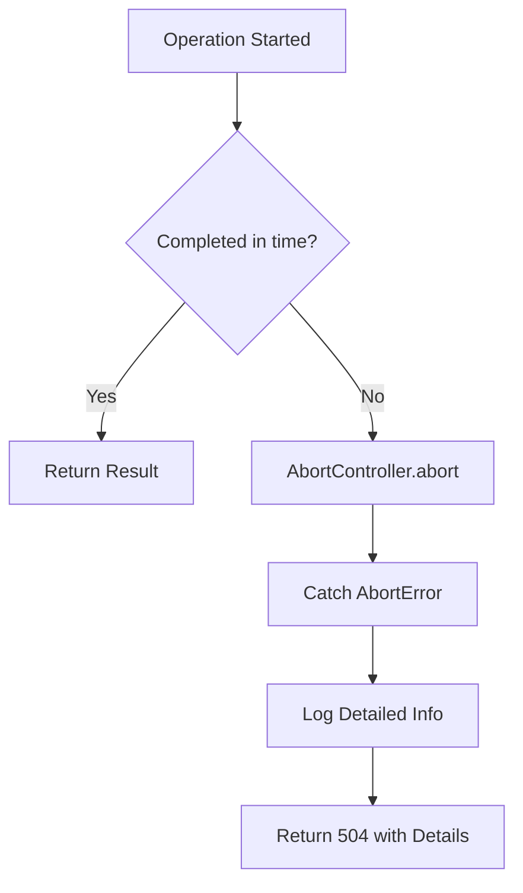

# Design Document: Fix Netlify Timeout

## Overview

This design addresses the 504 timeout errors occurring on the `/api/analyze-pitch` endpoint. The root cause is an invalid `timeout` parameter being passed to the OpenAI SDK constructor, which causes a 400 error. Additionally, the application needs optimization for Netlify's shorter timeout limits (10s free tier, 26s Pro).

The fix involves:
1. Removing the invalid `timeout` parameter from OpenAI SDK initialization
2. Implementing proper request-level timeouts using the SDK's native mechanism
3. Optimizing all operations to complete within Netlify's constraints

## Architecture



## Components and Interfaces

### 1. OpenAI Client Configuration (`lib/aiAnalyzer.ts`)

The OpenAI SDK must be initialized without the invalid `timeout` parameter:

```typescript
// BEFORE (broken):
const openai = new OpenAI({
  apiKey: process.env.OPENAI_API_KEY,
  timeout: TIMEOUTS.OPENAI_ANALYSIS, // INVALID - causes 400 error
})

// AFTER (fixed):
const openai = new OpenAI({
  apiKey: process.env.OPENAI_API_KEY,
})
```

Request-level timeouts are handled via AbortController passed to individual API calls:

```typescript
const controller = new AbortController()
const timeoutId = setTimeout(() => controller.abort(), TIMEOUTS.OPENAI_ANALYSIS)

try {
  const response = await openai.chat.completions.create({
    model: 'gpt-4o-mini',
    messages: conversationMessages,
    // ... other options
  }, {
    signal: controller.signal
  })
} finally {
  clearTimeout(timeoutId)
}
```

### 2. Timeout Utility (`lib/timeout.ts`)

The existing `withTimeout` utility remains unchanged but is used correctly:

```typescript
export async function withTimeout<T>(
  promise: Promise<T>,
  timeoutMs: number,
  errorMessage?: string
): Promise<T>
```

### 3. API Route Handler (`app/api/analyze-pitch/route.ts`)

The route handler orchestrates the request flow with proper timeout handling at each stage.

## Data Models

### Timeout Configuration

```typescript
export const TIMEOUTS = {
  OPENAI_TRANSCRIBE: 20000,    // 20s for audio transcription
  OPENAI_CHAT: 15000,          // 15s for chat completion
  OPENAI_ANALYSIS: 20000,      // 20s for pitch analysis
  OPENAI_REALTIME_SESSION: 8000, // 8s for session creation
  PDF_PARSE: 15000,            // 15s for PDF parsing
  FIREBASE_OPERATION: 5000,    // 5s for Firebase operations
}

export const MAX_CONTENT_LENGTH = 15000 // ~15k chars
```

### Error Response Structure

```typescript
interface TimeoutErrorResponse {
  error: string           // User-friendly message
  details?: {
    elapsed: number       // Time elapsed before timeout
    timeout: number       // Configured timeout value
    operation?: string    // Which operation timed out
    error?: string        // Original error message
  }
}
```

## Correctness Properties

*A property is a characteristic or behavior that should hold true across all valid executions of a system—essentially, a formal statement about what the system should do. Properties serve as the bridge between human-readable specifications and machine-verifiable correctness guarantees.*

### Property 1: Request Timeout Aborts Correctly

*For any* OpenAI API request that exceeds the configured timeout duration, the request SHALL be aborted via AbortController and return a timeout error rather than hanging indefinitely.

**Validates: Requirements 1.3, 1.4**

### Property 2: Invalid Requests Rejected Early

*For any* request missing required fields (transcript or file_context) OR exceeding content size limits, the API SHALL return a 400 error before attempting expensive operations like OpenAI API calls.

**Validates: Requirements 4.2, 4.3**

### Property 3: Timeout Errors Are Descriptive

*For any* timeout error returned by the system, the error message SHALL contain: (a) which operation timed out, (b) the elapsed time, (c) the configured timeout value, and (d) a remediation suggestion.

**Validates: Requirements 5.1, 5.2, 5.3, 5.4**

### Property 4: Content Truncation Before API Calls

*For any* content (transcript or file_context) exceeding MAX_CONTENT_LENGTH, the system SHALL truncate it to MAX_CONTENT_LENGTH before passing to the OpenAI API.

**Validates: Requirements 6.3**

## Error Handling

### Error Categories

| Error Type | HTTP Status | Cause | User Message |
|------------|-------------|-------|--------------|
| No Auth | 401 | Missing Bearer token | "Unauthorized: Please log in first" |
| Invalid Token | 401 | Token verification failed | "Unauthorized: Invalid token" |
| Service Unavailable | 503 | Firebase not initialized | "Authentication service unavailable" |
| Bad Request | 400 | Missing required fields | "No input provided (transcript or file)" |
| Auth Timeout | 504 | Token verification slow | "Authentication timed out. Please try again." |
| Analysis Timeout | 504 | OpenAI API slow | "Analysis timed out. Please try with shorter content." |
| Rate Limit | 403 | Usage limit exceeded | Dynamic message from limits check |
| OpenAI Error | 500 | OpenAI API error | "OpenAI API error: {details}" |

### Timeout Error Flow



## Testing Strategy

### Unit Tests

Unit tests verify specific examples and edge cases:

1. **OpenAI Client Initialization**: Verify client is created without invalid parameters
2. **Content Truncation**: Test that content over MAX_CONTENT_LENGTH is truncated
3. **Error Response Format**: Verify timeout errors include required fields
4. **Request Validation**: Test 400 responses for missing fields

### Property-Based Tests

Property tests verify universal properties across many generated inputs using a property-based testing library (e.g., fast-check for TypeScript):

1. **Property 1**: Generate random delays, verify timeout behavior
2. **Property 2**: Generate invalid request payloads, verify early rejection
3. **Property 3**: Generate timeout scenarios, verify error message completeness
4. **Property 4**: Generate content of various lengths, verify truncation

Each property test should run minimum 100 iterations and be tagged with:
```typescript
// Feature: fix-netlify-timeout, Property 1: Request Timeout Aborts Correctly
// Validates: Requirements 1.3, 1.4
```

### Integration Tests

1. Test full request flow with valid input
2. Test timeout handling end-to-end
3. Test Firebase initialization caching
